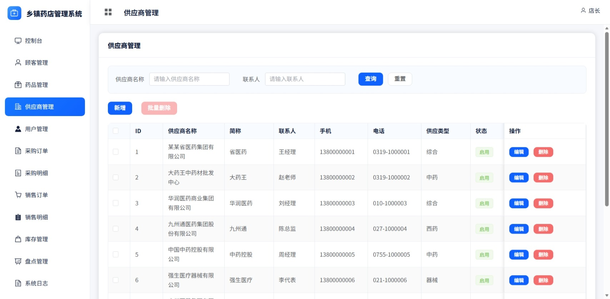
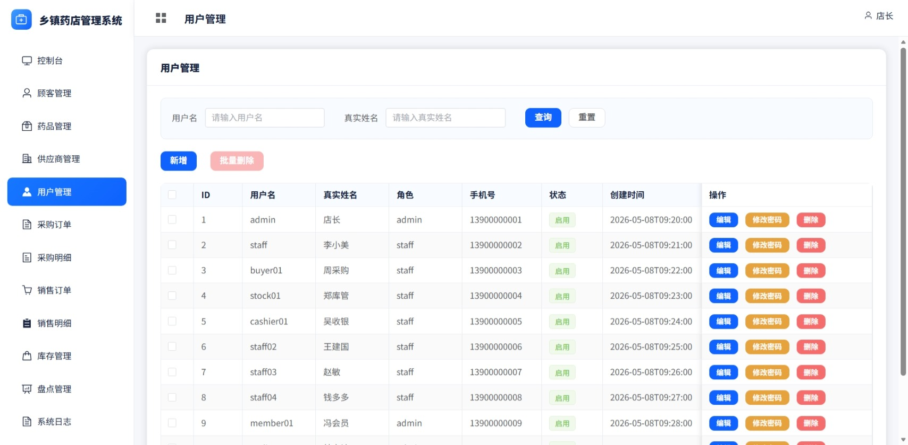
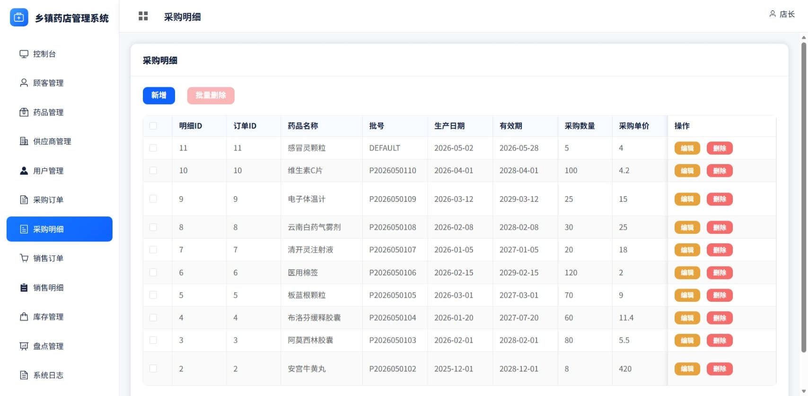
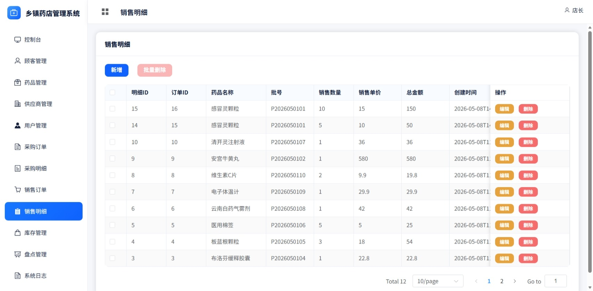
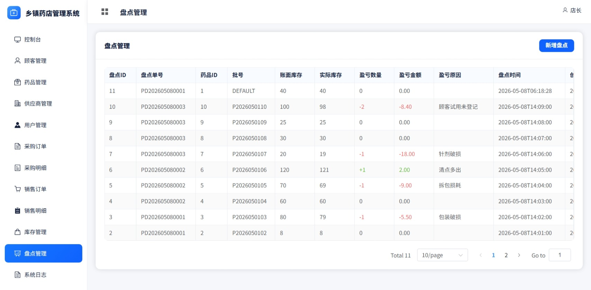

# 乡镇药店管理系统

乡镇药店管理系统是一个基于 Spring Boot 3、MyBatis-Plus、MySQL、Vue 3 和 Element Plus 开发的前后端分离管理端项目。系统面向乡镇单体药店或小型药房的日常经营场景，围绕药品档案、供应商、顾客会员、采购、销售、库存、盘点和系统日志等业务进行设计。

本项目当前已完成的是**管理端**，主要用于药店工作人员进行进销存业务管理。用户端和 AI 智能客服属于后续扩展方向，暂不作为当前 GitHub 项目的主要展示内容。

## 项目简介

传统乡镇药店在经营过程中经常依赖纸质台账或简单表格记录药品、库存、采购和销售数据，容易出现库存不清、近效期药品难以追踪、会员消费记录分散、操作记录不可追溯等问题。

本系统通过管理端页面将药店日常业务统一到一个轻量化后台中，帮助药店完成基础数据维护、进销存记录、库存预警、销售统计和操作审计。

## 界面预览

### 登录与控制台

| 登录页 | 控制台 |
| --- | --- |
|  |  |

### 基础档案管理

| 药品管理 | 顾客管理 |
| --- | --- |
|  |  |

| 供应商管理 | 用户管理 |
| --- | --- |
|  |  |

### 进销存业务

| 采购订单 | 采购明细 |
| --- | --- |
|  |  |

| 销售订单 | 销售明细 |
| --- | --- |
|  |  |

| 库存管理 | 盘点管理 |
| --- | --- |
|  |  |

### 系统审计

| 系统日志 |
| --- |
|  |

## 功能模块

### 控制台

- 展示当日营业额、订单数量、库存预警、近效期药品等经营数据。
- 提供销售开单、采购入库、药品录入、会员登记、库存盘点等快捷入口。
- 展示近期销售订单和采购记录，方便工作人员快速掌握药店运营状态。

### 药品管理

- 维护药品名称、类型、规格、剂型、零售价、生产厂家等基础信息。
- 支持中药、西药、医疗器械等类型管理。
- 支持处方药标识和药品状态管理。
- 为采购、销售、库存等业务提供基础药品数据。

### 供应商管理

- 维护供应商名称、联系人、联系电话、供应类型、合作状态等信息。
- 支持供应商查询、维护和状态管理。
- 为采购入库和库存溯源提供供应渠道数据。

### 顾客 / 会员管理

- 维护顾客姓名、手机号、会员状态、会员等级和累计消费金额。
- 支持会员启用、停用和资料维护。
- 与销售订单联动，用于统计会员消费记录。

### 采购管理

- 采购订单用于记录采购单号、供应商、采购时间、总金额、支付方式和入库状态。
- 采购明细用于记录本次采购的药品、批号、有效期、进价、数量和建议药柜位置。
- 保留完整入库依据，方便后续库存追踪和财务核对。

### 销售管理

- 销售订单用于记录订单号、顾客信息、操作员、下单时间、总金额、支付方式和支付状态。
- 销售明细用于记录订单中每种药品的销售数量、单价和小计金额。
- 支持会员消费金额累计，为顾客管理提供数据来源。

### 库存管理

- 按药品和批号管理库存数据。
- 展示生产日期、有效期、库存数量、成本价、药柜位置和供应商信息。
- 支持近效期、库存不足、过期等状态提示。

### 盘点管理

- 记录账面库存、实际库存、盈亏数量和盈亏金额。
- 支持填写盘点原因，便于后续责任追踪和财务核查。
- 用于乡镇药店定期库存核对。

### 系统日志

- 记录用户登录、查询、新增、修改、删除等操作行为。
- 支持按操作人、模块、类型和时间筛选。
- 仅管理员可查看，保障系统操作可追溯。

## 技术栈

| 模块 | 技术 |
| --- | --- |
| 后端 | Spring Boot 3.2.5、Spring Security、MyBatis-Plus、Spring AOP |
| 数据库 | MySQL 8.x |
| 前端 | Vue 3、Vue Router、Element Plus、Axios、Vite |
| 运行环境 | JDK 17、Node.js 18+ |
| 架构模式 | 前后端分离 |

## 项目结构

```text
pharmacy-system/
├── pharmacy-admin/                 后端服务
│   ├── src/main/java/com/pharmacy/
│   │   ├── annotation/             操作日志注解
│   │   ├── aspect/                 日志切面
│   │   ├── common/                 统一响应结果
│   │   ├── config/                 安全、MyBatis-Plus 等配置
│   │   ├── controller/             控制层接口
│   │   ├── dto/                    请求参数对象
│   │   ├── entity/                 数据库实体
│   │   ├── exception/              全局异常处理
│   │   ├── mapper/                 数据访问层
│   │   ├── service/                业务接口与实现
│   │   ├── util/                   工具类
│   │   └── vo/                     页面展示对象
│   └── src/main/resources/
│       └── application.yml         后端配置文件
├── pharmacy-ui/                    管理端前端
│   ├── src/api/                    接口请求封装
│   ├── src/layout/                 管理端布局
│   ├── src/router/                 路由配置
│   ├── src/styles/                 全局样式
│   └── src/views/                  页面视图
├── docs/
│   ├── gld/                        管理端页面截图
│   └── pms_db.sql                  数据库初始化脚本
├── .gitignore
└── README.md
```

## 快速启动

### 1. 环境要求

- JDK 17+
- Node.js 18+
- MySQL 8.x
- Maven 3.8+

### 2. 初始化数据库

创建数据库：

```sql
CREATE DATABASE pms_db DEFAULT CHARACTER SET utf8mb4 COLLATE utf8mb4_general_ci;
```

导入数据库脚本：

```text
docs/pms_db.sql
```

### 3. 修改后端配置

根据本地 MySQL 账号修改：

```text
pharmacy-admin/src/main/resources/application.yml
```

默认配置示例：

```yaml
server:
  port: 8080

spring:
  datasource:
    url: jdbc:mysql://localhost:3306/pms_db?useUnicode=true&characterEncoding=utf-8&serverTimezone=Asia/Shanghai&useSSL=false
    username: root
    password: your_password
```

### 4. 启动后端

```bash
cd pharmacy-admin
mvn spring-boot:run
```

也可以打包运行：

```bash
mvn clean package -DskipTests
java -jar target/pharmacy-admin-1.0.0.jar
```

后端默认端口：

```text
http://localhost:8080
```

### 5. 启动前端

```bash
cd pharmacy-ui
npm install
npm run dev
```

前端默认端口：

```text
http://localhost:3000
```

构建生产包：

```bash
npm run build
```

## 数据库说明

系统核心数据表围绕以下业务设计：

- 用户表：系统管理员和店员账号。
- 药品表：药品基础档案。
- 供应商表：药品供应渠道。
- 顾客表：顾客和会员资料。
- 采购订单表：采购主单。
- 采购明细表：采购药品明细。
- 销售订单表：销售主单。
- 销售明细表：销售药品明细。
- 库存表：药品批次库存。
- 盘点表：库存盘点记录。
- 系统日志表：操作审计记录。

完整建表语句和初始化数据见：

```text
docs/pms_db.sql
```

## 项目亮点

- 贴近乡镇药店实际业务，覆盖药品、库存、采购、销售、会员、供应商、盘点和日志管理。
- 前后端分离架构，后端接口职责清晰，前端页面模块独立。
- 使用 MyBatis-Plus 简化单表 CRUD 和分页查询。
- 通过 Spring AOP + 自定义注解记录系统操作日志。
- 支持管理员和店员角色区分，前端路由与后端安全配置结合。
- 库存按药品批号管理，便于追踪有效期和库存状态。
- 控制台集中展示经营概览和业务提醒，方便药店工作人员快速查看运营情况。

## 后续规划

- 完善销售出库、采购入库和库存自动联动。
- 增加 Excel 导入导出功能。
- 增加订单小票打印能力。
- 增加用户端项目，提供药品查询、会员消费记录查询和药店信息展示。
- 预留 AI 智能客服，用于药品库存、营业时间、门店地址等便民咨询。
- 增加 Docker 部署和生产环境 Nginx 配置。

## 说明

本项目主要用于学习、课程设计、毕业设计、简历作品和乡镇药店业务数字化场景演示。药品相关信息仅用于系统功能展示，实际用药请遵医嘱或咨询专业药师。
