# 乡镇药店管理系统

一个面向乡镇单体药店和小型药房的前后端分离管理系统，覆盖药品档案、供应商、顾客会员、采购入库、销售出库、库存预警、库存盘点、Excel 导入导出、系统日志、用户端药品查询和规则型 AI 客服等场景。

项目采用 Spring Boot 3、MyBatis-Plus、MySQL、Vue 3、Element Plus 和 Vite 开发，包含后端服务、管理端前端和用户端前端三个主要工程。

## 项目模块

| 模块 | 路径 | 说明 |
| --- | --- | --- |
| 后端服务 | `pharmacy-admin` | Spring Boot REST API，提供管理端和用户端接口 |
| 管理端前端 | `pharmacy-ui` | 面向药店工作人员的进销存管理后台 |
| 用户端前端 | `pharmacy-client` | 面向顾客的药品查询、会员中心、药店信息和 AI 客服页面 |
| 文档与资源 | `docs` | 数据库脚本、迁移脚本、开发记录和页面截图 |

## 功能概览

### 管理端

- 登录、控制台经营数据概览
- 药品档案管理：药品名称、类型、规格、剂型、价格、生产厂家、处方药标识等
- 供应商管理：供应商资料、联系方式、供货类型和合作状态
- 顾客/会员管理：会员资料、等级、状态和累计消费金额
- 采购管理：采购订单、采购明细、批号、有效期和入库状态
- 采购入库联动：采购单确认入库后自动增加库存，阻止重复入库
- 销售管理：销售订单、销售明细、支付方式和会员消费累计
- 销售出库联动：销售单确认出库后自动扣减库存，库存不足时拦截
- 库存管理：按药品和批号维护库存、有效期、货位、预警下限和库存状态
- 库存盘点：账面库存、实际库存、盈亏数量和盘点原因
- Excel 功能：药品导出、药品导入模板、药品导入、库存导出、采购订单导出、销售订单导出
- 系统日志：记录登录、查询、新增、修改、删除等操作行为

### 用户端

- 首页：展示药店服务、常用入口和经营信息
- 药品查询：支持关键词、分类、剂型、处方药和库存状态筛选
- 药品详情：展示药品价格、规格、库存、处方药提示和购买说明
- 会员中心：查看会员资料和消费记录
- 药店信息：展示营业时间、联系电话、地址、路线和服务公告
- AI 客服：规则型客服，支持营业时间、地址电话、处方药、会员记录、药品库存入口等常见问题回答

## 页面预览

### 管理端

| 登录页 | 控制台 |
| --- | --- |
| 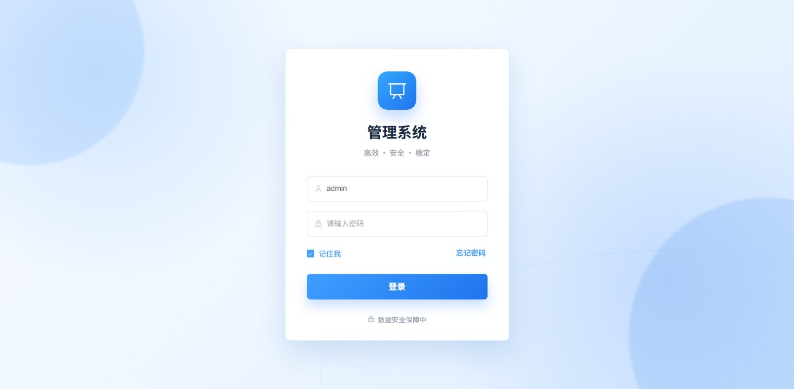 | 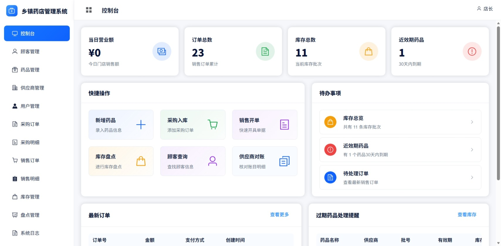 |

| 药品管理 | 顾客管理 |
| --- | --- |
| 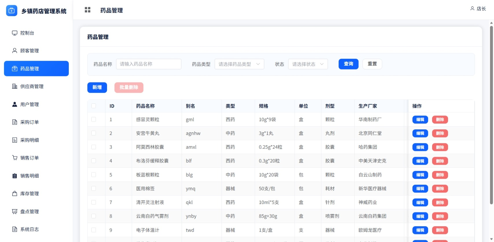 | 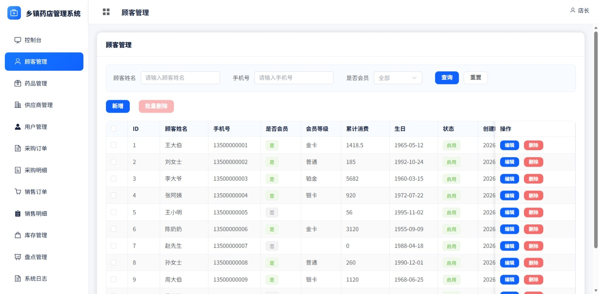 |

| 采购订单 | 销售订单 |
| --- | --- |
| 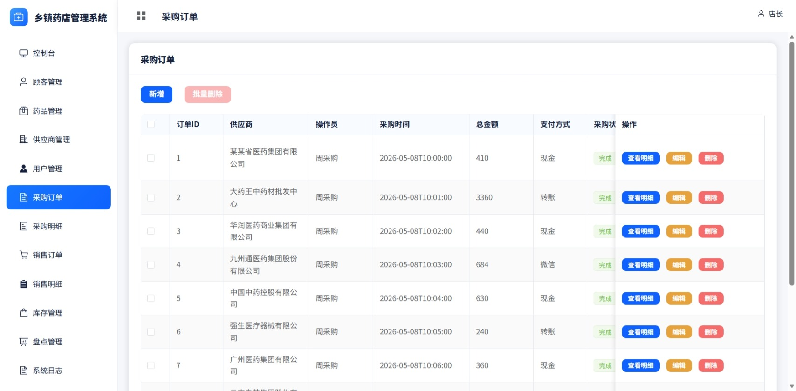 | 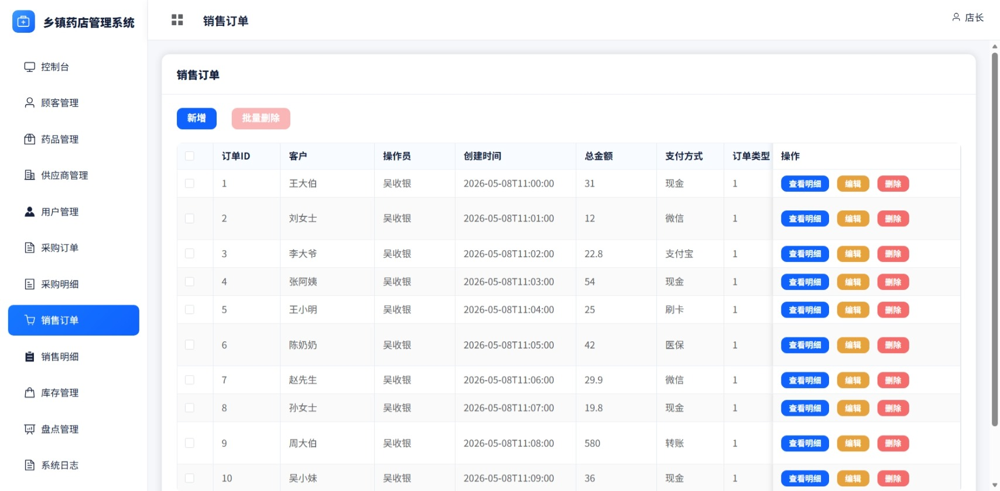 |

| 库存管理 | 系统日志 |
| --- | --- |
| 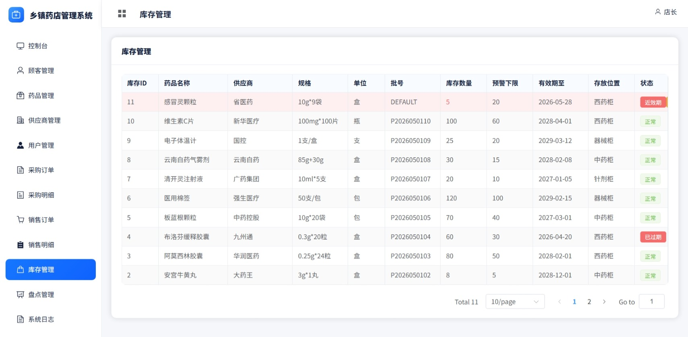 | 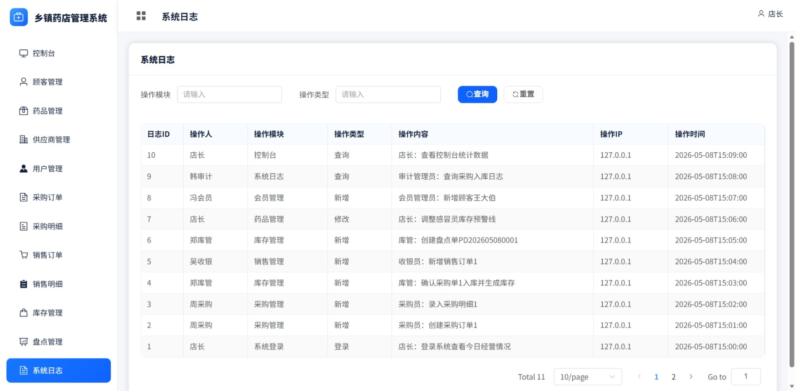 |

### 用户端

| 首页 | 药品查询 |
| --- | --- |
| 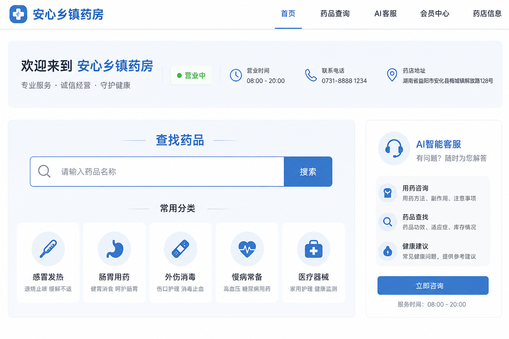 | 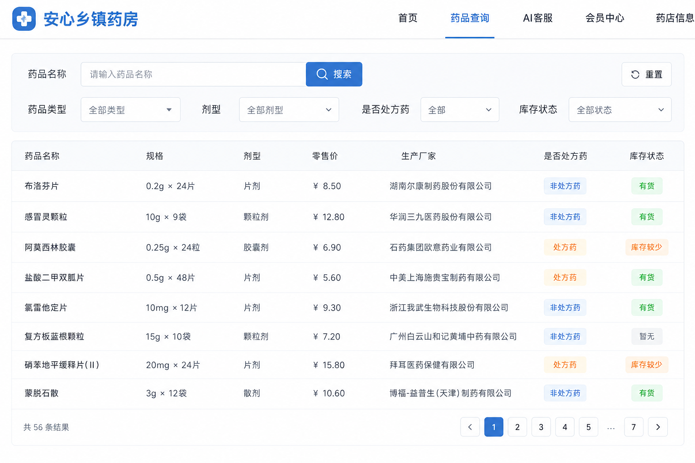 |

| 药品详情 | 会员中心 |
| --- | --- |
| 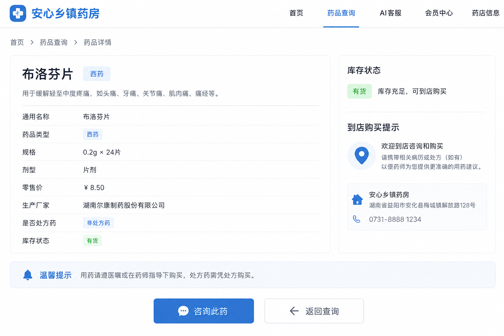 | 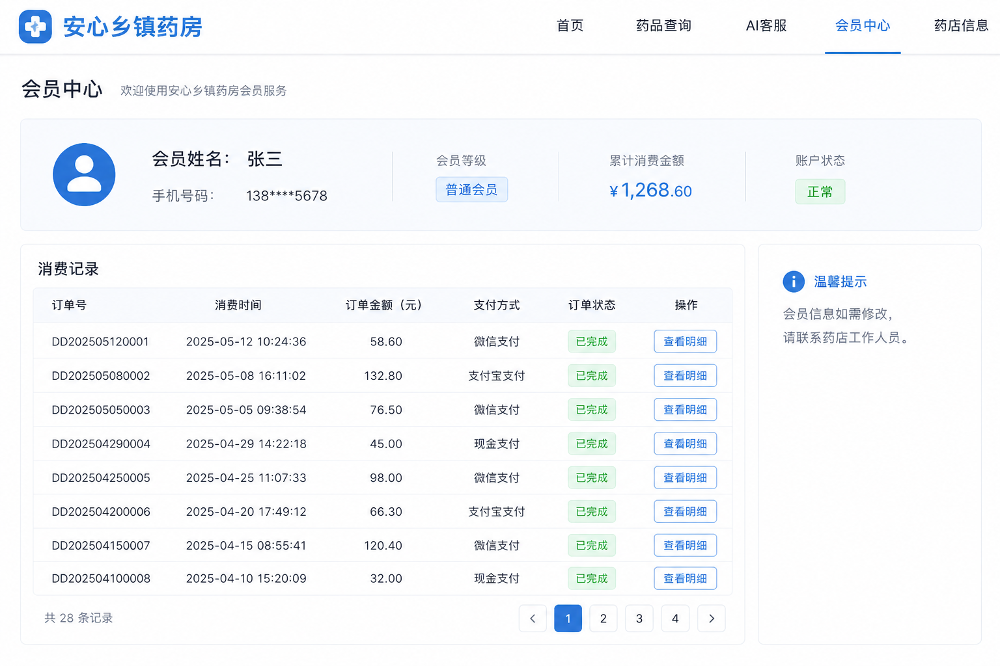 |

| 药店信息 | AI 客服 |
| --- | --- |
| 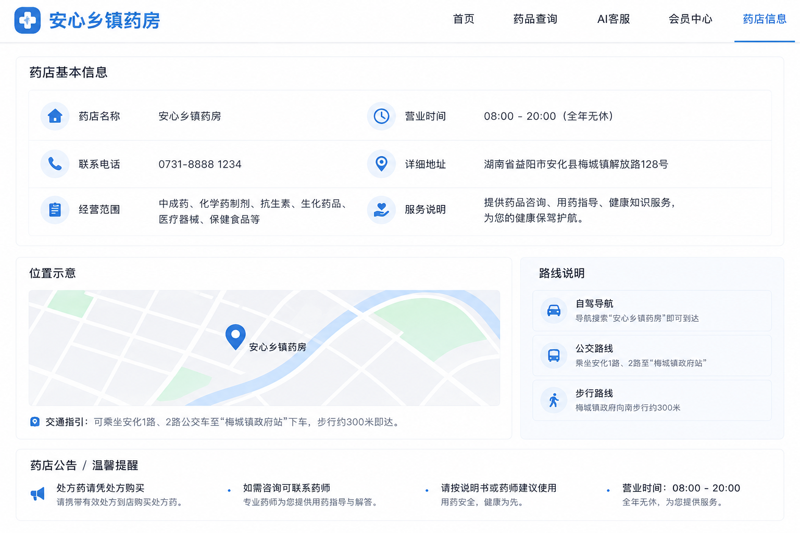 | 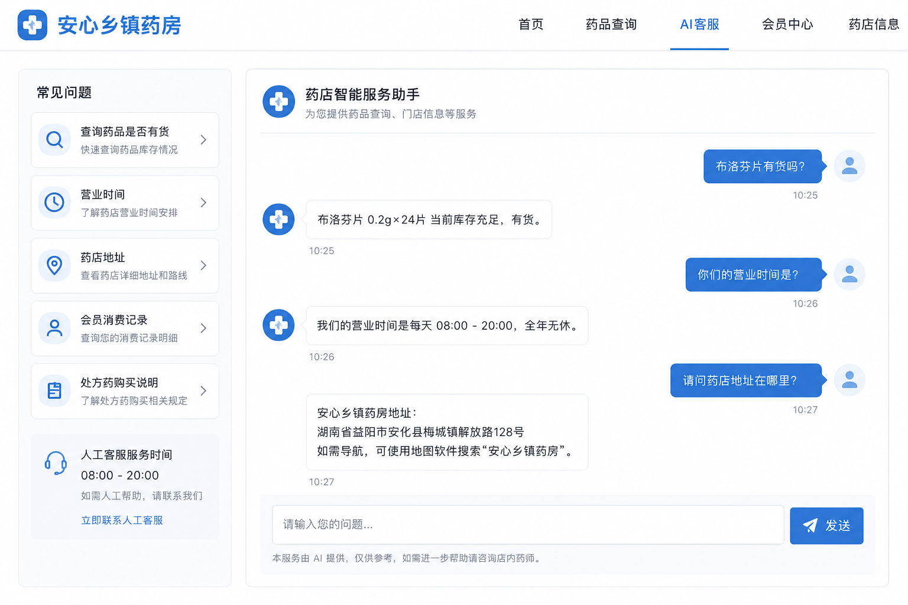 |

## 技术栈

| 分类 | 技术 |
| --- | --- |
| 后端 | Spring Boot 3.2.5、Spring Security、Spring AOP、MyBatis-Plus、EasyExcel |
| 数据库 | MySQL 8.x |
| 管理端前端 | Vue 3、Vue Router、Element Plus、Axios、Vite |
| 用户端前端 | Vue 3、Vue Router、Element Plus、Axios、Vite |
| 运行环境 | JDK 17+、Node.js 18+、Maven 3.8+ |

## 项目结构

```text
pharmacy-system/
├─ pharmacy-admin/                 # 后端服务
│  ├─ src/main/java/com/pharmacy/
│  │  ├─ annotation/               # 操作日志注解
│  │  ├─ aspect/                   # 日志切面
│  │  ├─ common/                   # 统一响应结果
│  │  ├─ config/                   # 安全、MyBatis-Plus 等配置
│  │  ├─ controller/               # 接口控制层
│  │  ├─ dto/                      # 请求参数对象
│  │  ├─ entity/                   # 数据库实体
│  │  ├─ excel/                    # Excel 导入导出行模型
│  │  ├─ exception/                # 全局异常处理
│  │  ├─ mapper/                   # 数据访问层
│  │  ├─ service/                  # 业务服务
│  │  ├─ util/                     # 工具类
│  │  └─ vo/                       # 页面展示对象
│  └─ src/main/resources/
│     └─ application.yml           # 后端配置
├─ pharmacy-ui/                    # 管理端前端
├─ pharmacy-client/                # 用户端前端
├─ docs/
│  ├─ pms_db.sql                   # 数据库结构和测试数据脚本
│  ├─ migrate-stock-min-to-stock.sql # 旧库库存预警字段迁移脚本
│  ├─ gld/                         # 管理端截图
│  ├─ images/                      # 用户端截图
│  └─ client-dev-notes/            # 用户端开发记录
├─ .gitignore
└─ README.md
```

## 快速启动

### 1. 环境要求

- JDK 17+
- Maven 3.8+
- Node.js 18+
- MySQL 8.x

### 2. 初始化数据库

创建数据库：

```sql
CREATE DATABASE pms_db DEFAULT CHARACTER SET utf8mb4 COLLATE utf8mb4_0900_ai_ci;
```

导入脚本：

```text
docs/pms_db.sql
```

当前 `pms_db.sql` 已包含完整表结构和每张表 20 条测试数据。新版结构中：

- `medicine` 表不再包含 `stock_min`
- `stock` 表包含 `stock_min`，用于库存预警下限

如果是旧数据库升级，可参考：

```text
docs/migrate-stock-min-to-stock.sql
```

### 3. 配置数据库环境变量

后端 `application.yml` 默认从环境变量读取数据库连接信息：

```yaml
spring:
  datasource:
    url: ${DB_URL:jdbc:mysql://localhost:3306/pms_db?useUnicode=true&characterEncoding=utf-8&serverTimezone=Asia/Shanghai&useSSL=false}
    username: ${DB_USERNAME:root}
    password: ${DB_PASSWORD:}
```

Windows PowerShell 当前终端临时设置示例：

```powershell
$env:DB_URL="jdbc:mysql://localhost:3306/pms_db?useUnicode=true&characterEncoding=utf-8&serverTimezone=Asia/Shanghai&useSSL=false"
$env:DB_USERNAME="root"
$env:DB_PASSWORD="your_password"
```

### 4. 启动后端

```bash
cd pharmacy-admin
mvn spring-boot:run
```

也可以先打包再运行：

```bash
cd pharmacy-admin
mvn clean package -DskipTests
java -jar target/pharmacy-admin-1.0.0.jar
```

后端默认地址：

```text
http://127.0.0.1:8080
```

### 5. 启动管理端

```bash
cd pharmacy-ui
npm install
npm run dev
```

管理端默认开发端口以 Vite 输出为准，当前配置常见为：

```text
http://127.0.0.1:3000
```

### 6. 启动用户端

```bash
cd pharmacy-client
npm install
npm run dev -- --host 127.0.0.1
```

用户端默认开发地址：

```text
http://127.0.0.1:5174
```

## 常用验证命令

后端编译：

```bash
cd pharmacy-admin
mvn -q -DskipTests package
```

管理端构建：

```bash
cd pharmacy-ui
npm run build
```

用户端构建：

```bash
cd pharmacy-client
npm run build
```

AI 客服接口示例：

```http
POST http://127.0.0.1:8080/api/client/chat
Content-Type: application/json

{
  "message": "药店营业时间是几点？"
}
```

采购入库接口示例：

```http
POST http://127.0.0.1:8080/api/purchase-order/{purchaseId}/inbound
```

销售出库接口示例：

```http
POST http://127.0.0.1:8080/api/sale-order/{orderId}/outbound
```

Excel 相关接口：

```text
GET  /api/medicine/export
GET  /api/medicine/import-template
POST /api/medicine/import
GET  /api/stock/export
GET  /api/purchase-order/export
GET  /api/sale-order/export
```

## 数据库说明

系统核心数据表围绕以下业务设计：

- 用户表：系统管理员和店员账号
- 药品表：药品基础档案
- 供应商表：药品供应渠道
- 顾客表：顾客和会员资料
- 采购订单表：采购主单
- 采购明细表：采购药品明细
- 库存表：药品批次库存、预警下限和有效期管理
- 销售订单表：销售主单
- 销售明细表：销售药品明细
- 库存盘点表：库存盘点记录
- 系统日志表：操作审计记录

完整建表语句和测试数据见：

```text
docs/pms_db.sql
```

## 安全说明

- 数据库密码建议通过 `DB_PASSWORD` 环境变量配置，不要提交真实密码。
- AI 客服为规则型客服，不接入外部大模型，不依赖外网和 API Key。
- AI 客服仅用于药店服务咨询和系统演示，不能替代医生或药师诊断。
- 涉及具体病情、诊断、剂量、疗程或联合用药时，应咨询专业医生或药师。

## 后续规划

- 增加订单小票打印能力
- 补充更完整的接口文档和部署文档
- 增加 Docker 部署和生产环境 Nginx 配置
- 优化前端构建分包，减少 Vite 大 chunk 提示

## 项目用途

本项目主要用于课程设计、毕业设计、学习实践、简历作品和乡镇药店数字化业务演示。药品相关信息仅用于系统功能展示，实际用药请遵医嘱或咨询专业药师。
